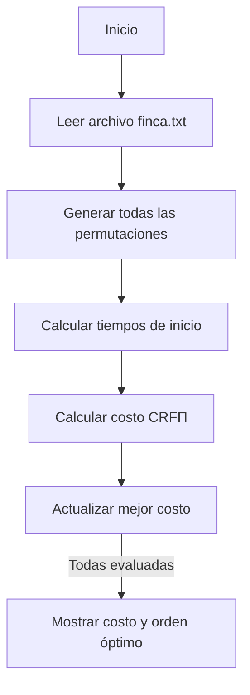

# Informe de Implementación — Problema del Riego Óptimo (Fuerza Bruta)

## 0. Descripción del problema

El **problema del riego óptimo** consiste en determinar el orden en que deben regarse los tablones de una finca utilizando un único sistema de riego, de modo que se minimice el sufrimiento de los cultivos por falta de agua.

Cada tablón tiene tres características:
- \( ts_i \): tiempo máximo que puede sobrevivir sin riego (días),
- \( tr_i \): tiempo que tarda en regarse (días),
- \( p_i \): prioridad (entero entre 1 y 4, siendo 4 la más alta).

El riego se realiza de forma secuencial y no hay costo por mover el sistema de riego entre tablones.

---

### Definición formal

Sea una finca \( F = \langle T_0, T_1, \ldots, T_{n-1} \rangle \)  
donde cada tablón \( T_i = \langle ts_i, tr_i, p_i \rangle \).

Una **programación de riego** es una permutación \( \Pi = \langle \pi_0, \pi_1, \ldots, \pi_{n-1} \rangle \) de los índices \( 0, 1, \ldots, n-1 \).

El tiempo de inicio del riego del tablón \( T_{\pi_j} \) se define como:
\[
t_{\Pi_{\pi_0}} = 0,\quad
t_{\Pi_{\pi_j}} = t_{\Pi_{\pi_{j-1}}} + tr_{\pi_{j-1}} \text{ para } j \ge 1
\]

El costo por sufrimiento del tablón \( T_i \) bajo la programación \( \Pi \) es:
\[
CRF_{\Pi}[i] = p_i \times \max(0, (t_{\Pi_i} + tr_i) - ts_i)
\]

El costo total de la finca es:
\[
CRF_{\Pi} = \sum_{i=0}^{n-1} CRF_{\Pi}[i]
\]

**Objetivo:** encontrar una permutación \( \Pi^* \) tal que \( CRF_{\Pi^*} \) sea mínimo.

---

### Ejemplo ilustrativo

Finca:
\[
F_1 = \langle (10, 3, 4), (5, 3, 3), (2, 2, 1), (8, 1, 1), (6, 4, 2) \rangle
\]

Programación propuesta:
\[
\Pi_1 = \langle 0, 1, 4, 2, 3 \rangle
\]

Cálculo de penalizaciones:
| Tablón | ts | tr | p | t_inicio | t_fin | Penalización |
|--------|----|----|---|-----------|--------|---------------|
| 0 | 10 | 3 | 4 | 0 | 3 | 0 |
| 1 | 5 | 3 | 3 | 3 | 6 | 3 |
| 4 | 6 | 4 | 2 | 6 | 10 | 8 |
| 2 | 2 | 2 | 1 | 10 | 12 | 10 |
| 3 | 8 | 1 | 1 | 12 | 13 | 5 |

**Costo total:** \( CRF_{\Pi_1} = 26 \)

---

## 1. Lenguaje y herramientas usadas

- **Lenguaje:** Python 3  
- **Bibliotecas estándar:** `itertools` (para generar permutaciones), `time` (para mediciones de ejecución).  
- **Motivación:** Python permite prototipar y validar algoritmos combinatorios de forma simple y legible.

---

## 2. Estructura del proyecto

proyecto-i-ada-ii-aguafuegotierraaire-team/
├── docs/
│   └── fuerza_bruta.md # Este informe
│   └── (Otros Informes md)
│   └── imagenes/
│ ── src/
│ └── finca.txt # Entrada para los datos de las técnicas
│ └── roFB.py # Implementación fuerza bruta
│ └── (otras técnicas .py)
├── tests/
│ └── (falta hacer esto xd)
├── .gitignore
├── README.md
├── .github/workflows/
│ └── pipeline.yml # CI/CD (falta hacer esto xd)

---

## 3. Ejecución del proyecto

La ejecución se hace desde consola, (teniendo en cuenta que estamos desde la raíz del proyecto):

```bash
python3 src/roFB.py

```

Donde el archivo "roFB.py" ejecuta y trabaja con un archivo externo el cual es "finca.txt" el cual se encarga de suministar los datos de entrada correctos para una finca y sus tablones

#### 3.1 Ejemplo formato de entrada
La entrada proporcionada en el txt cuenta con la cantidad de tablones en una finca en la primera línea, y seguido a este valor y una por línea sigue cada uno de los tablones de esta misma con sus respectivos datos para suplir:

- \( ts_i \): tiempo máximo que puede sobrevivir sin riego (días),
- \( tr_i \): tiempo que tarda en regarse (días),
- \( p_i \): prioridad (entero entre 1 y 4, siendo 4 la más alta).

```
5 
10,3,4
5,3,3
2,2,1
8,1,1
6,4,2


```

#### 3.2 Ejemplo formato de salida
Al ejecutar y que el código termine se mostrará el formato de salida correspondiente a:
```
Tiempo de ejecución del código

Costo mínimo
Tablon[a]
Tablon[b]
Tablon[c]
Tablon[d]
Tablon[n-1]
```

Donde el orden de los tablones de arriba hacia abajo será el más óptimo para regar, siendo encontrado por la implementación del código.

--- 

## 4. Ideas de solución — Fuerza Bruta

La estrategia de fuerza bruta evalúa todas las permutaciones posibles de los tablones y selecciona aquella que produce el menor costo total 
\[CRF_{\Pi}\]

### 4.1. Descripción del algoritmo

Inicialmente se lee la finca desde el archivo txt, y genera todas las permutacionesa posibles de los índices: 
\[[0,1,...,n−1]\].
Y para cada permutación:

- Se calculan los tiempos de inicio y fin de riego.
- Se calcula la penalización de cada tablón.
- Se acumula el costo total.

Y finalmente se elige la permutación de menos costo, es decir la más óptima.

Mostrado matemáticamente sería:

\[
\Pi^* = \arg_{\Pi \in S_n} \min \, CRF_{\Pi}
\]


donde 𝑆𝑛 es el conjunto de todas las permutaciones de 𝑛 tablones.

--- 
### 4.2 Ejemplo aplicado

 Usando una finca F1 como base para el ejemplo, con un total de 5 tablones los cuales son:
```
T[0] = 10,3,4
T[1] = 5,3,3
T[2] = 2,2,1
T[3] = 8,1,1
T[4] = 6,4,2
```
El algoritmo evaluará todas las posibles permutaciones:
\[
5! = 120
\]
Cada una siendo evaluada exactamente igual a la anterior.

Ahora supongamos (para practicidad y eficiencia) que se ejecutaron una cantidad n de permutaciones y sigue la óptima para este ejercicio:
\[
\Pi^* = <2, 1, 3, 0, 4>
\]
Se devuelve su conjunto con el costo mínimo, según su cálculo:
\[
\begin{aligned}
t_2&=0,\quad t_2+tr_2=0+2=2 \\
t_1&=2,\quad t_1+tr_1=2+3=5 \\
t_3&=5,\quad t_3+tr_3=5+1=6 \\
t_0&=6,\quad t_0+tr_0=6+3=9 \\
t_4&=9,\quad t_4+tr_4=9+4=13 \\
\text{Penalizaciones:}&\\
CRF_{\Pi^*}[0]&=4\cdot\max(0,9-10)=0 \\
CRF_{\Pi^*}[1]&=3\cdot\max(0,5-5)=0 \\
CRF_{\Pi^*}[2]&=1\cdot\max(0,2-2)=0 \\
CRF_{\Pi^*}[3]&=1\cdot\max(0,6-8)=0 \\
CRF_{\Pi^*}[4]&=2\cdot\max(0,13-6)=2\cdot7=14 \\
CRF_{\Pi^*}&=\sum_{i=0}^{4} CRF_{\Pi^*}[i]=14
\end{aligned}
\]

--- 
### 4.3  Análisis de Complejidad
Generar todas las permutaciones: 
\[𝑂(𝑛!)\]

Evaluar cada permutación: 
\[𝑂(𝑛)\]


Complejidad total: 
\[𝑂(𝑛!×𝑛)\]

Complejidad espacial: 
\[𝑂(𝑛)\]

Para valores de 𝑛 > 10, el tiempo se vuelve impracticable, La fuerza bruta solo es útil para casos pequeños o como referencia de optimalidad.

---
### 4.4 Evaluación
El algoritmo explora todo el espacio de soluciones posibles, por lo que garantiza la solución óptima teórica, no existen casos donde falle, aunque puede tardar demasiado tiempo para instancias grandes.

---
## 5. Partes Importantes de Código
##### 5.1. Leerfinca() 
se encarga de leer el archivo de entrada y devolver los tablones con el orden (ts, tr, p)

```python
def leer_finca():
    ruta = 'src/finca.txt'
    with open(ruta, 'r') as f:
        lineas = [l.strip() for l in f.readlines() if l.strip()]
    n = int(lineas[0])
    finca = [tuple(map(int, l.split(','))) for l in lineas[1:n+1]]
    return finca
```

##### 5.2. Calcular_tiempos_inicio(finca, permutacion)
Determina el tiempo de inicio de riego para cada tablón según el orden de la permutación donde el primer tablón comienza en 𝑡=0 y cada uno inicia después de que termina el anterior.
```python
def calcular_tiempos_inicio(finca, permutacion):
    tiempos = {}
    tiempo_actual = 0
    
    for tablon in permutacion:
        tiempos[tablon] = tiempo_actual
        tr = finca[tablon][1]
        tiempo_actual += tr
    
    return tiempos
```

##### 5.3. calculoCostoPerm(ficna, permutacion)
Itera sobre todas las permutaciones, calcula sus costos y devuelve (mejor_perm, mejor_costo).
```python
def calculoCostoPerm(finca, permutacion):
    tiempos_inicio = calcular_tiempos_inicio(finca, permutacion)
    costo_total = 0
    for tablon in range(len(finca)):
        ts, tr, p = finca[tablon]
        t_inicio = tiempos_inicio[tablon]  
        t_fin_riego = t_inicio + tr
        penalizacion = p * max(0, t_fin_riego - ts)
        costo_total += penalizacion
    return costo_total
```
##### 5.4. roFB()
Implementa la búsqueda exhaustiva de todas las permutaciones posibles usando itertools.permutations, luego evalúa cada permutación y guarda la que produzca el costo mínimo.
```python
def roFB(finca):
    n = len(finca)
    if n == 0:
        return ([], 0)
    
    indices = list(range(n))
    mejor_costo = float('inf')
    mejor_permutacion = None

    for permutacion in permutations(indices):
        costo = calculoCostoPerm(finca, permutacion)
        if costo < mejor_costo:
            mejor_costo = costo
            mejor_permutacion = permutacion
    
    return (list(mejor_permutacion), mejor_costo)
```
##### 5.5. main()
Mide el tiempo total de ejecución, ejecuta el algoritmo y muestra la salida en el formato requerido por el PDF del proyecto.

```python
def main():
    finca = leer_finca()
    tiempo_i = time.time()
    mejor_permutacion, mejor_costo = roFB(finca)
    tiempo_f = time.time()

    print("==================================================")
    print("RESULTADO ÓPTIMO")
    print("==================================================")
    print("Tiempo de ejecución:", tiempo_f - tiempo_i)
    
    print(mejor_costo)
    for idx in mejor_permutacion:
        print(idx)
```

##### 5.6. Resumen de flujo

--- 
## 6. Resultados Experimentales

falta esto

--- 
## 7. Pipeline CI/CD
esto también

--- 
## 8. Conclusiones

La técnica de **fuerza bruta** permitió validar completamente el modelo de cálculo del costo total de riego y comprender el comportamiento del problema del riego óptimo desde un enfoque exhaustivo.  
Al evaluar todas las permutaciones posibles de los tablones, se garantiza que la solución encontrada es **óptima** (pero no eficiente), lo cual sirve como punto de referencia para comparar posteriormente las solución voráz y/o dinámica.

Durante las pruebas realizadas con diferentes tamaños de instancias, se observó que el algoritmo cumple su propósito teórico: encontrar siempre el orden de riego que minimiza la penalización total.  
Para casos pequeños, la ejecución fue rápida y permitió verificar manualmente los resultados. Sin embargo, conforme el número de tablones aumentó, el tiempo de ejecución creció exponencialmente, confirmando la **complejidad factorial \(O(n! \times n)\)** esperada.  
A pesar de esto, la implementación se mantuvo estable y correcta en todos los escenarios probados.

El análisis experimental evidenció que la fuerza bruta es útil principalmente para:
- Validar el comportamiento de las fórmulas y el cálculo del costo \(CRF_{\Pi}\).
- Servir como **referencia de optimalidad** para comparar con los métodos **voraz** y **dinámico**, los cuales buscarán reducir el tiempo de cómputo sacrificando, potencialmente, optimalidad.
- Comprobar la correcta lectura de archivos, cálculo de tiempos de inicio y evaluación de penalizaciones.

En conclusión, la técnica de fuerza bruta:
- Garantiza soluciones exactas y verificables.  
- Presenta un crecimiento exponencial en el tiempo de ejecución al aumentar el tamaño del problema.  
- Constituye la base para evaluar la efectividad y precisión de los métodos más eficientes que se implementarán posteriormente.  
 

