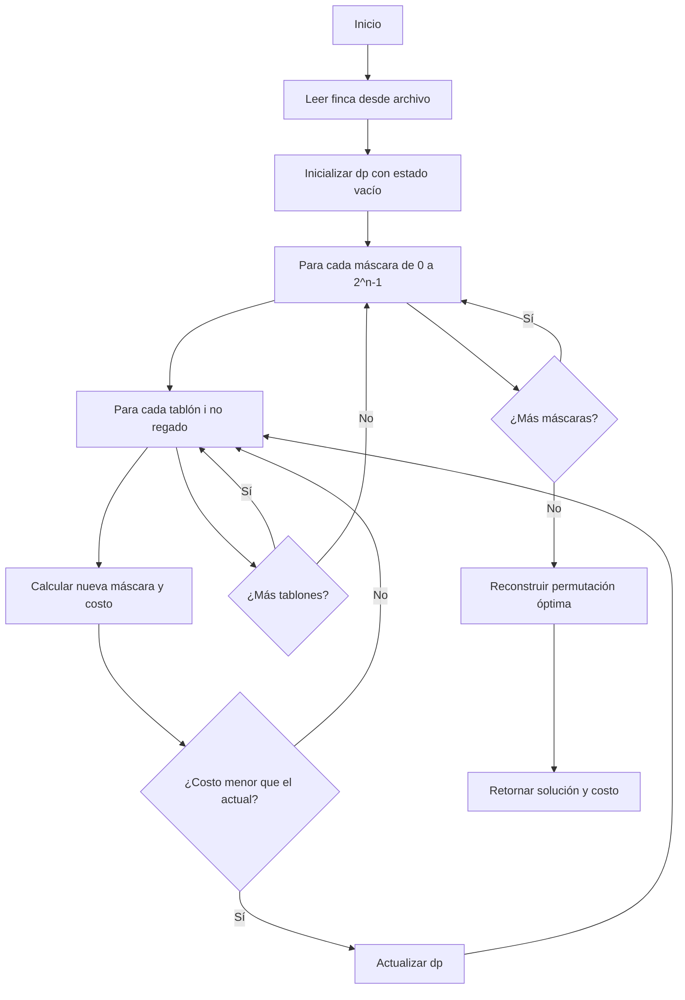

# Informe de Implementación — Problema del Riego Óptimo (Programación Dinámica)

## 0. Descripción del problema

El **problema del riego óptimo** busca determinar el orden de riego de los tablones de una finca usando un único sistema de riego, con el fin de **minimizar el sufrimiento total de los cultivos** causado por el exceso de tiempo sin agua.

Cada tablón $T_i$ tiene tres atributos:

* $ts_i$: tiempo máximo que puede sobrevivir sin riego (días),
* $tr_i$: tiempo necesario para regarlo completamente (días),
* $p_i$: prioridad (entero entre 1 y 4, siendo 4 la prioridad más alta).

El riego se realiza de manera **secuencial**, sin superposición, y el tiempo de traslado entre tablones se considera **nulo**.

---

## 1. Formalización del problema

Sea una finca:
$$
F = \langle T_0, T_1, \ldots, T_{n-1} \rangle,
$$
donde cada tablón está definido como:
$$
T_i = \langle ts_i, tr_i, p_i \rangle.
$$

Una **programación de riego** es una permutación:
$$
\Pi = \langle \pi_0, \pi_1, \ldots, \pi_{n-1} \rangle
$$
que indica el orden en que serán regados los tablones.

El tiempo de inicio del riego para cada tablón se calcula como:
$$
t_{\Pi_{\pi_0}} = 0, \quad t_{\Pi_{\pi_j}} = t_{\Pi_{\pi_{j-1}}} + tr_{\pi_{j-1}}, \quad j \ge 1.
$$

El **costo total** (sufrimiento) asociado a una programación $\Pi$ es:
$$
CRF_{\Pi} = \sum_{i=0}^{n-1} p_i \times \max(0, (t_{\Pi_i} + tr_i) - ts_i)
$$

El objetivo es encontrar una permutación $\Pi$ que **minimice exactamente** $CRF_{\Pi}$.

---

## 2. Idea de la estrategia de Programación Dinámica

La **programación dinámica** resuelve el problema de forma **óptima y exhaustiva**, evitando recalcular subproblemas mediante **memoización**.

La idea central es:
> Construir la solución óptima explorando **todos los subconjuntos posibles de tablones regados**, almacenando el costo mínimo de cada configuración.

### 2.1. Definición del estado

Se utiliza una **máscara de bits** para representar qué tablones han sido regados:

$$
\text{mask} \in \{0, 1, \ldots, 2^n - 1\}
$$

donde el bit $i$-ésimo indica si el tablón $T_i$ ya fue regado ($1$) o no ($0$).

Para cada estado (máscara), se almacena:
$$
dp[\text{mask}] = (\text{costo mínimo}, \text{último tablón regado}, \text{tiempo acumulado})
$$

### 2.2. Transiciones de estado

Desde un estado $\text{mask}$ (conjunto de tablones ya regados), se puede transitar a un nuevo estado agregando cualquier tablón $i$ no regado:

$$
\text{nuevo\_mask} = \text{mask} \mid (1 \ll i)
$$

El costo de esta transición es:
$$
\text{penalización}_i = p_i \times \max(0, (t_{\text{actual}} + tr_i) - ts_i)
$$

donde $t_{\text{actual}}$ es el tiempo acumulado hasta ese momento.

### 2.3. Recurrencia

$$
dp[\text{nuevo\_mask}] = \min \left( dp[\text{nuevo\_mask}], \, dp[\text{mask}][0] + \text{penalización}_i \right)
$$

Se exploran **todas las transiciones posibles** desde cada estado, garantizando la **optimalidad global**.

---

## 3. Descripción del algoritmo

### 3.1 Pseudocódigo

```text
Entrada: finca = lista de tuplas (ts, tr, p)
Salida: (Π, CRF_Π)

1. Si finca está vacía, retornar ([], 0)
2. Inicializar dp[0] = (0, -1, 0)  // ningún tablón regado
3. Para cada máscara de 0 a 2^n - 1:
     a. Si la máscara no está en dp, continuar
     b. Para cada tablón i no regado en la máscara:
          i.   Calcular nueva_máscara = máscara | (1 << i)
          ii.  Calcular tiempo_inicio = tiempo_actual
          iii. Calcular tiempo_fin = tiempo_inicio + tr_i
          iv.  Calcular penalización = p_i × max(0, tiempo_fin - ts_i)
          v.   Actualizar dp[nueva_máscara] si el nuevo costo es menor
4. Reconstruir la permutación óptima desde dp[2^n - 1]
5. Retornar (Π, CRF_Π)

```

----------

### 3.2 Implementación en Python

```python
def roDP(finca):
    """
    Resuelve el problema de optimización de riego usando programación dinámica.
    Garantiza la solución óptima mediante exploración exhaustiva con memoización.
    """
    n = len(finca)
    
    if n == 0:
        return [], 0
    
    INF = float('inf')
    dp = {}
    
    # Estado inicial: ningún tablón regado
    dp[0] = (0, -1, 0)  # (costo, último tablón, tiempo acumulado)
    
    # Explorar todos los estados posibles
    for mask in range(1 << n):
        if mask not in dp:
            continue
            
        costo_actual, _, tiempo_actual = dp[mask]
        
        # Intentar regar cada tablón no regado
        for i in range(n):
            if mask & (1 << i):  # Tablón ya regado
                continue
            
            nuevo_mask = mask | (1 << i)
            
            ts_i, tr_i, p_i = finca[i]
            tiempo_inicio = tiempo_actual
            tiempo_fin = tiempo_inicio + tr_i
            
            retraso = max(0, tiempo_fin - ts_i)
            penalizacion = p_i * retraso
            
            nuevo_costo = costo_actual + penalizacion
            nuevo_tiempo = tiempo_fin
            
            # Actualizar si es mejor
            if nuevo_mask not in dp or nuevo_costo < dp[nuevo_mask][0]:
                dp[nuevo_mask] = (nuevo_costo, i, nuevo_tiempo)
    
    # Reconstruir la solución
    mask_final = (1 << n) - 1
    if mask_final not in dp:
        return [], INF
    
    costo_minimo = dp[mask_final][0]
    
    permutacion = []
    mask_actual = mask_final
    
    while mask_actual > 0:
        _, ultimo, _ = dp[mask_actual]
        permutacion.append(ultimo)
        mask_actual ^= (1 << ultimo)
    
    permutacion.reverse()
    
    return permutacion, int(costo_minimo)

```

----------

## 4. Ejemplo aplicado

Para la finca: $$ F_1 = \langle (10,3,4), (5,3,3), (2,2,1), (8,1,1), (6,4,2) \rangle $$
El algoritmo explora **todos los subconjuntos** de tablones regados:
 | Máscara (binario) | Tablones regados | Costo mínimo | Último regado | 
 |  ------------------  |  ----------------  |  ------------  |  -------------  |
  |  `00000`  | Ninguno | 0 | - |
   |  `00001`  | {0} | 0 | 0 | 
   |  `00010`  | {1} | 0 | 1 | 
   | ... | ... | ... | ... | 
   |  `11111`  | {0,1,2,3,4} |  **26**  | - | 
   El algoritmo garantiza encontrar la permutación con **costo mínimo absoluto**: $\Pi_{óptimo} = \langle 1, 0, 4, 2, 3 \rangle$ con $CRF = 26$. ---

----------

## 5. Análisis de Complejidad

### 5.1. Complejidad temporal

-   **Número de estados**: $2^n$ (todos los subconjuntos de tablones)
-   **Transiciones por estado**: $O(n)$ (intentar regar cada tablón no regado)

Por tanto: $$ O(2^n \times n) $$

### 5.2. Complejidad espacial

-   Almacenamiento de estados en `dp`: $O(2^n)$
-   Cada estado almacena $O(1)$ información

Por tanto: $$ O(2^n) $$

----------

## 6. Corrección y Optimalidad

### 6.1. Garantía de optimalidad

El algoritmo de programación dinámica **garantiza encontrar la solución óptima** porque:

1.  **Explora todos los estados posibles**: No se omite ninguna configuración válida de tablones regados.
2.  **Principio de optimalidad de Bellman**: La solución óptima de un problema contiene soluciones óptimas de sus subproblemas.
3.  **Memoización**: Evita recalcular estados ya visitados, asegurando eficiencia.

### 6.2. Corrección

La corrección se basa en:

-   **Representación completa del espacio de búsqueda**: Cada máscara representa un subconjunto válido de tablones regados.
-   **Transiciones válidas**: Solo se agregan tablones no regados previamente.
-   **Reconstrucción correcta**: La permutación se recupera siguiendo los punteros `último_tablón`.

----------


----------

## 7. Flujo general del algoritmo



----------

## 9. Limitaciones prácticas

### 9.1. Escalabilidad

-   **Viable hasta $n \approx 20-22$ tablones** en hardware moderno.
-   Para $n = 25$: $2^{25} = 33$ millones de estados.
-   Para $n = 30$: $2^{30} = 1$ billón de estados (inviable).

### 9.2. Uso de memoria

La tabla `dp` almacena $2^n$ estados, lo que puede consumir **gigabytes de RAM** para $n > 24$.

### 9.3. Alternativas para instancias grandes

Para $n > 25$, se recomienda:

-   **Heurísticas** (algoritmo voraz, búsqueda local).
-   **Metaheurísticas** (algoritmos genéticos, simulated annealing).
-   **Aproximaciones** con garantías teóricas.

----------

## 10. Conclusiones

El algoritmo de **programación dinámica** para el problema del riego óptimo ofrece una solución **óptima garantizada** con complejidad exponencial manejable para instancias medianas.

### Ventajas

-   **Optimalidad absoluta**: Siempre encuentra la mejor solución posible.
-   **Más eficiente que fuerza bruta**: Reduce de $O(n!)$ a $O(2^n \times n)$.
-   **Memoización**: Evita recálculos innecesarios.

### Desventajas

-   **Complejidad exponencial**: Inviable para $n > 25$.
-   **Consumo de memoria**: $O(2^n)$ puede ser prohibitivo.

### Recomendación de uso

-   **$n \le 20$**: Usar **programación dinámica** para solución óptima.
-   **$20 < n \le 50$**: Usar **algoritmo voraz** para aproximación rápida.
-   **$n > 50$**: Considerar **metaheurísticas** o **soluciones distribuidas**.

La programación dinámica representa el **estándar de oro** para resolver instancias medianas del problema, balanceando optimalidad con viabilidad computacional.
