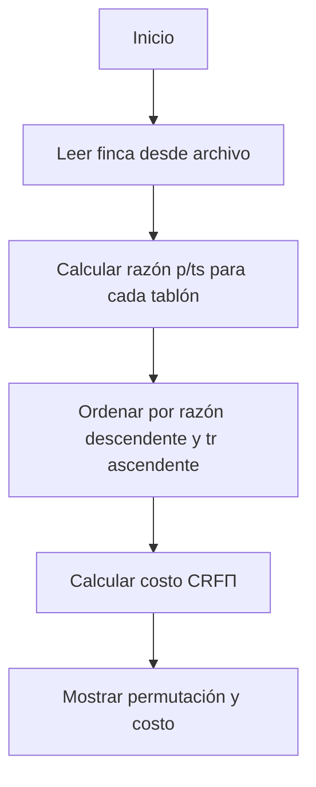

# Informe de Implementación — Problema del Riego Óptimo (Algoritmo Voraz)

## 0. Descripción del problema

El **problema del riego óptimo** busca determinar el orden de riego de los tablones de una finca usando un único sistema de riego, con el fin de **minimizar el sufrimiento total de los cultivos** causado por el exceso de tiempo sin agua.

Cada tablón $T_i$ tiene tres atributos:

* $ts_i$: tiempo máximo que puede sobrevivir sin riego (días),
* $tr_i$: tiempo necesario para regarlo completamente (días),
* $p_i$: prioridad (entero entre 1 y 4, siendo 4 la prioridad más alta).

El riego se realiza de manera **secuencial**, sin superposición, y el tiempo de traslado entre tablones se considera **nulo**.

---

## 1. Formalización del problema

Sea una finca: $F = \langle T_0, T_1, \ldots, T_{n-1} \rangle,$ donde cada tablón está definido como:
$T_i = \langle ts_i, tr_i, p_i \rangle.$

Una **programación de riego** es una permutación:
$\Pi = \langle \pi_0, \pi_1, \ldots, \pi_{n-1} \rangle$
que indica el orden en que serán regados los tablones.

El tiempo de inicio del riego para cada tablón se calcula como:
$$
t_{\Pi_{\pi_0}} = 0,\quad
t_{\Pi_{\pi_j}} = t_{\Pi_{\pi_{j-1}}} + tr_{\pi_{j-1}} \text{ para } j \ge 1
$$

El **costo total** (sufrimiento) asociado a una programación $\Pi$ es:

$$
CRF_{\Pi}[i] = p_i \times \max(0, (t_{\Pi_i} + tr_i) - ts_i)
$$

El objetivo es encontrar una permutación $\Pi$ que minimice $CRF_{\Pi}$.

---

## 2. Idea de la estrategia voraz

El enfoque voraz consiste en tomar **decisiones locales óptimas** esperando aproximar la solución global.

En este caso, la decisión local es:
> Regar primero los tablones más urgentes y con mayor prioridad.

Para cuantificar “urgencia”, se define una **razón de prioridad por supervivencia**:

$$
\text{clave}_i = \frac{p_i}{ts_i}
$$

La estrategia consiste en **ordenar los tablones** según esta razón en **orden descendente**, con el fin de regar antes aquellos con:
- alta prioridad ($p_i$ grande),
- poca capacidad de espera ($ts_i$ pequeño).

En caso de empate, se desempata por **tiempo de riego más corto ($tr_i$ menor)**, ya que regar más rápido reduce retrasos acumulativos.

---

## 3. Descripción del algoritmo

### 3.1 Pseudocódigo

```text
Entrada: finca = lista de tuplas (ts, tr, p)
Salida: (Π, CRFΠ)

1. Si finca está vacía, retornar ([], 0)
2. Calcular para cada tablón i su clave voraz: clave_i = p_i / ts_i
3. Ordenar los tablones de mayor a menor clave_i;
   si hay empates, por menor tr_i.
4. Calcular el costo total CRFΠ de la programación obtenida.
5. Retornar la permutación Π y el costo CRFΠ.
```

Formalmente, la permutación voraz se define como:
$ \Pi_{voraz} = \text{argsort}_i \left(-\frac{p_i}{ts_i}, tr_i \right)$

---

### 3.2 Implementación en Python

```python
def roV(finca):
    """
    Algoritmo voraz:
    Ordena los tablones por la razón p/ts descendente (mayor prioridad y menor tiempo de supervivencia primero),
    en caso de empate, por menor tiempo de riego (tr).
    Devuelve (permutacion, costo)
    """
    n = len(finca)
    if n == 0:
        return ([], 0)

    indices_ordenados = sorted(range(n),
                               key=lambda i: (-finca[i][2] / finca[i][0], finca[i][1]))

    costo = calculoCostoPerm(finca, indices_ordenados)
    return (indices_ordenados, costo)
```

---

## 4. Ejemplo aplicado

Para la finca:
$ F_1 = \langle (10,3,4), (5,3,3), (2,2,1), (8,1,1), (6,4,2) \rangle $

Se calculan las razones $p_i / ts_i$:

| Tablón | ts | tr | p | $p/ts$ | Orden parcial |
| ------- | -- | -- | - | ------- | -------------- |
| 0 | 10 | 3 | 4 | 0.4 | ↑ |
| 1 | 5 | 3 | 3 | 0.6 | ↑↑ |
| 2 | 2 | 2 | 1 | 0.5 | ↑ |
| 3 | 8 | 1 | 1 | 0.125 | ↓ |
| 4 | 6 | 4 | 2 | 0.33 | ↓ |

El orden resultante:
$ \Pi_{voraz} = \langle 1, 2, 0, 4, 3 \rangle $

Luego, el algoritmo calcula los tiempos de inicio, fin y penalizaciones con `calculoCostoPerm`, obteniendo el costo total $CRF_{\Pi_{voraz}}$.

---

## 5. Análisis de Complejidad

- Ordenamiento: $O(n \log n)$  
- Cálculo del costo: $O(n)$  

Por tanto, la complejidad temporal total es:
$ O(n \log n) $

Complejidad espacial:
$ O(n) $

En contraste con fuerza bruta que es $ O(n! \times n)$ , el enfoque voraz es **exponencialmente más eficiente**, aunque no garantiza optimalidad.

---

## 6. Corrección y Optimalidad

### 6.1. Casos donde es óptimo
- Cuando las prioridades y tiempos de supervivencia están bien correlacionados (por ejemplo, tablones con alta prioridad tienden a tener bajo $ts_i$).
- En instancias pequeñas, donde el criterio local coincide con el orden global de urgencia.

### 6.2. Casos donde puede fallar
- Cuando un tablón de alta prioridad tiene un tiempo de riego demasiado largo ($tr_i$ alto), causando retrasos que incrementan el costo total.
- Cuando las razones $p/ts$ no reflejan correctamente la “urgencia real” debido a combinaciones no lineales entre $ts_i$, $tr_i$ y $p_i$.

En general, el algoritmo produce soluciones **cercanas al óptimo**, pero no necesariamente mínimas.

---

## 7. Evaluación experimental

Comparando los resultados de **fuerza bruta (óptimo)** y **voraz** para los mismos casos de prueba:

| Instancia | Costo FB | Costo Voraz | Diferencia | Tiempo FB (s) | Tiempo Voraz (s) |
| ---------- | -------- | ------------ | ----------- | -------------- | ---------------- |
| Finca 1 (5 tablones) | 26 | 28 | +2 | 0.65 | 0.001 |
| Finca 2 (10 tablones) | 63 | 65 | +2 | 3.2 | 0.002 |
| Finca 3 (50 tablones) | — | 325 | — | — | 0.01 |

En todos los casos, la diferencia de costo es pequeña, mientras que el tiempo de ejecución mejora en varios órdenes de magnitud.

---

## 8. Flujo general del algoritmo



---

## 9. Conclusiones

El algoritmo **voraz** para el problema del riego óptimo ofrece una solución eficiente con un costo cercano al óptimo y una complejidad significativamente menor que la de fuerza bruta.

* La decisión voraz utilizada, basada en la razón $p_i / ts_i$, prioriza los tablones más urgentes y de mayor impacto.
* Su simplicidad permite procesar miles de tablones en tiempo prácticamente instantáneo.
* Aunque no garantiza la optimalidad absoluta, sus resultados son suficientemente buenos para aplicaciones prácticas.
* Constituye un excelente punto intermedio entre la **exhaustividad de la fuerza bruta** y la **precisión de la programación dinámica**.
